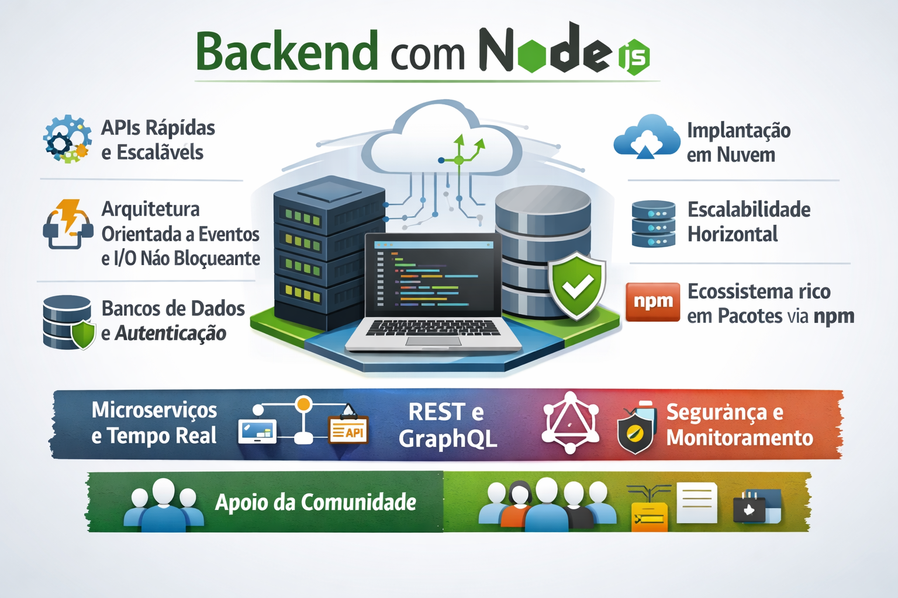

# Desenvolvimento de Backend com Nodejs
Backend com Node.js é focado no desenvolvimento do lado servidor usando JavaScript. Ele permite criar APIs rápidas e escaláveis, lidar com bancos de dados, autenticação e regras de negócio. É muito usado com Express, NestJS e integra-se bem a aplicações web modernas.

Além disso, o Node.js utiliza arquitetura orientada a eventos e I/O não bloqueante, garantindo alto desempenho. É ideal para aplicações em tempo real, microserviços e sistemas robustos, com grande ecossistema de pacotes via npm. Também oferece facilidade de deploy em nuvem, boa escalabilidade horizontal e ampla adoção no mercado, sendo uma escolha sólida para projetos modernos e times que utilizam JavaScript em todo o stack.

Node.js também conta com forte apoio da comunidade, atualizações frequentes e integração com ferramentas de segurança, testes e monitoramento, tornando o desenvolvimento backend mais produtivo, confiável e alinhado às boas práticas do mercado.

Além disso, é compatível com arquiteturas modernas como REST e GraphQL, facilita a manutenção do código e permite criar soluções eficientes para aplicações web, mobile e sistemas corporativos.

<p align="center">
    
</p>

## 🧱 VISÃO GERAL DO BACKEND

Stack principal

* Node.js (CommonJS)

* Express

* Sequelize (ORM)

* PostgreSQL (ou MySQL)

* Arquitetura em camadas

* Segurança completa (produção)

## Padrões

* MVC + Services

* Repository Pattern (via Sequelize)

* Environment Variables

* Middlewares globais

* Logs

* Tratamento centralizado de erros

## 📌 ETAPA 0: PRÉ-REQUISITOS

Antes de começar, você precisa ter:

* Node.js ≥ 18

* npm ou yarn

* Banco de dados (PostgreSQL recomendado)

* Conhecimento básico de JavaScript

## 📌 ETAPA 1: INICIALIZAÇÃO DO PROJETO

1️⃣ Criar a pasta do projeto

```
mkdir node_backend_any
cd node_backend_any
```
2️⃣ Inicializar o projeto Node
```
npm init -y
```
Isso cria o package.json, que controla dependências e scripts.

3️⃣ Definir CommonJS explicitamente

No package.json:

```
{
  "type": "commonjs"
}
```

Assim usamos require() e module.exports.
## 📌 ETAPA 2: DEPENDÊNCIAS PRINCIPAIS
### 📦 Dependências de PRODUÇÃO
```
npm install express sequelize pg pg-hstore dotenv
```
O que cada uma faz:

| Dependência | Função |
|:------------|:-------|
|Express|Framework HTTP|
|Sequelize|ORM|
|pg|Driver PostgreSQL|
|pg-hstore|Serialização|
|dotenv|Variáveis de ambiente|

### 📦 Dependências de SEGURANÇA

```
npm install helmet cors express-rate-limit bcrypt jsonwebtoken
```

Segurança aplicada:

|Pacote|Proteção|
|:---|:---|
|Helmet|Headers HTTP seguros|
|cors|Controle de origem|
|rate-limit| Anti Força Bruta|
|bcrypt|Hash de Senha|
|jsonwebtoken|Autenticação JWT|

### 📦 Dependências de Desenvolvimento

```
npm install -D nodemon sequelize-cli
```

### 📌 ETAPA 3: ESTRUTURA DE PASTAS (PROFISSIONAL)

```
src/
├── config/
│   ├── database.js
│   └── auth.js
├── database/
│   ├── migrations/
│   ├── models/
│   └── index.js
├── controllers/
├── services/
├── middlewares/
├── routes/
├── utils/
├── app.js
└── server.js
```

Por que essa estrutura?

* Separação de responsabilidades

* Escalável

* Fácil manutenção

* Padrão de mercado
  
### 📌 ETAPA 4: CONFIGURAÇÃO DO EXPRESS

src/app.js

```
const express = require('express');
const helmet = require('helmet');
const cors = require('cors');
const rateLimit = require('express-rate-limit');

const routes = require('./routes');

const app = express();

// Segurança
app.use(helmet());
app.use(cors());

app.use(
  rateLimit({
    windowMs: 15 * 60 * 1000,
    max: 100,
  })
);

// JSON
app.use(express.json());

// Rotas
app.use('/api', routes);

module.exports = app;

```
<hr>
src/server.js

```
require('dotenv').config();
const app = require('./app');

const PORT = process.env.PORT || 3000;

app.listen(PORT, () => {
  console.log(`🚀 Servidor rodando na porta ${PORT}`);
});
```

## 📌 ETAPA 5: VARIÁVEIS DE AMBIENTE

```
.env
```

```
PORT=confidencial

DB_HOST=confidencial
DB_USER=confidencial
DB_PASS=confidencial
DB_NAME=confidencial
DB_DIALECT=confidencial

JWT_SECRET=confidencial
JWT_EXPIRES_IN=confidencial

```
❗ Nunca versionar .env

## 📌 ETAPA 6: CONFIGURAÇÃO DO SEQUELIZE

```
src/config/database.js
```
```
require('dotenv').config();

module.exports = {
  dialect: process.env.DB_DIALECT,
  host: process.env.DB_HOST,
  username: process.env.DB_USER,
  password: process.env.DB_PASS,
  database: process.env.DB_NAME,
  define: {
    timestamps: true,
    underscored: true,
  },
};
```
```
src/database/index.js
```
```
const Sequelize = require('sequelize');
const dbConfig = require('../config/database');

const sequelize = new Sequelize(dbConfig);

module.exports = sequelize;
```
## 📌 ETAPA 7: SCRIPT DE EXECUÇÃO

No package.json:

```
"scripts": {
  "dev": "nodemon src/server.js",
  "start": "node src/server.js"
}
```