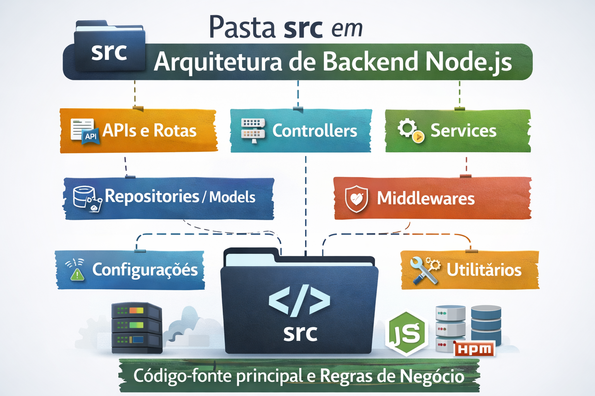

# 📁 src

A pasta **src** representa o núcleo da arquitetura do sistema backend desenvolvido em **Node.js**. É nela que se concentra todo o código-fonte responsável pelas regras de negócio, comunicação com banco de dados, APIs e integrações externas.

## 🎯 Objetivo da pasta src

Organizar e estruturar o backend de forma clara, escalável e de fácil manutenção, seguindo boas práticas de arquitetura de software.

## 🧱 Responsabilidades

Dentro da pasta `src`, normalmente são implementados:

- **APIs e Rotas**: definição dos endpoints da aplicação
- **Controllers**: camada responsável por receber requisições e retornar respostas
- **Services**: regras de negócio e lógica da aplicação
- **Repositories / Models**: acesso e manipulação de dados
- **Middlewares**: autenticação, validações e controle de requisições
- **Configurações**: variáveis de ambiente, conexões e inicializações
- **Utilitários**: funções reutilizáveis e helpers

## ⚙️ Arquitetura

O backend segue princípios como:

- Separação de responsabilidades
- Arquitetura em camadas
- Código modular e reutilizável
- Facilidade para testes e manutenção
- Escalabilidade e performance com Node.js

## 🚀 Tecnologias comuns

- Node.js
- Express ou NestJS
- Banco de dados SQL ou NoSQL
- REST ou GraphQL
- npm para gerenciamento de dependências

## 📌 Observação

Nenhuma lógica de infraestrutura externa (como scripts de deploy ou configurações de CI/CD) deve ficar nesta pasta. A `src` deve conter apenas código relacionado diretamente ao funcionamento da aplicação.

    

